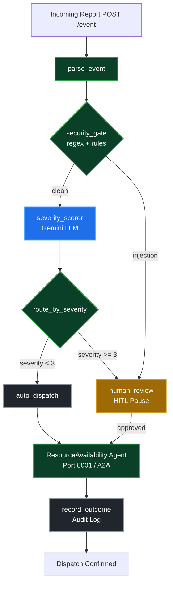

# 🚨 DispatchAI — Emergency Response Agent

> An ambient, multi-agent AI system for intelligent emergency dispatch triage — built with Google ADK 2.0, Gemini, A2A protocol, and MCP tools.


---

## What It Does

DispatchAI acts as the first line of defense for a 911-style emergency dispatch center. It automatically reads incoming emergency reports, screens them for security threats, scores their severity using an LLM, checks real-time resource availability via a second agent, and either dispatches units autonomously or escalates to a human supervisor — all in seconds.

**The core insight:** low-severity incidents (noise complaints, minor accidents) are auto-dispatched instantly. High-severity incidents (fires, medical emergencies) pause the workflow and wait for human approval before committing resources. This mirrors exactly how real dispatch centers operate.

---

## 🎥 Video Demo

[**▶️ Watch the full project walkthrough on YouTube**](https://youtube.com/your-video-link-here)

*(Replace the link above with your actual YouTube URL before submitting!)*

---

## Local Demo

```
http://localhost:8080
```

> See setup instructions below to run locally.

---

## Architecture



---

## Course Coverage (5-Day AI Agents Intensive)

| Day | Topic | Implementation |
|-----|-------|----------------|
| **1** | Agent fundamentals & loops | Main dispatch agent runs a full perceive → reason → act → observe graph workflow via ADK 2.0 |
| **2** | Tools & MCP | Security gate, triage, dispatch, and resource tools exposed as ADK `FunctionTool` nodes |
| **3** | Memory & sessions | `InMemoryRunner` tracks active sessions across HITL pauses; audit log persists events across the session |
| **4** | Agent quality & evals | LLM-as-judge eval pipeline across 10 scenarios, scoring routing correctness and security containment — **5.0/5.0** |
| **5** | A2A multi-agent & production | `ResourceAvailabilityAgent` served via `to_a2a()` on port 8001; main agent queries it via `RemoteA2aAgent` before every dispatch |

---

## Key Features

### 🛡️ Security Gate
Before the LLM ever sees a report, the system runs regex-based checks to:
- Redact PII (SSNs, phone numbers, emails, credit card numbers, addresses)
- Detect prompt injection attempts ("ignore previous instructions", "override system", etc.)

Reports that fail security are immediately flagged for human review — the LLM never processes them.

### 🧠 AI Triage
A Gemini LLM reads the sanitized report and returns:
- Severity score (1–5)
- Incident classification
- Recommended unit count
- Recommended response protocol

### 🔀 Smart Routing
- **Score < 3** → auto-dispatched instantly
- **Score ≥ 3 or injection detected** → escalated to human dispatcher via HITL

### ⏸️ Human-in-the-Loop (HITL)
High-severity events suspend the ADK workflow using `RequestInput`. The system waits — indefinitely if needed — for a human dispatcher to review and approve via `POST /approve`. This is not a timeout or a skip; the workflow genuinely pauses.

### 🤝 A2A Resource Agent
A separate `ResourceAvailabilityAgent` runs on port 8001 and maintains an in-memory fleet inventory:

| Type | Total |
|------|-------|
| 🚒 Fire Trucks | 5 |
| 🚑 Ambulances | 8 |
| 🚓 Police Cars | 10 |
| 🚐 General Units | 6 |

Before confirming any dispatch, the main agent queries availability via the A2A protocol. If fewer units are available than recommended, it adjusts: *"Recommended 10 fire trucks but only 4 available — dispatching 4."*

### 📊 Eval Pipeline
A standalone evaluation harness tests 10 scenarios:

| Scenario | Type |
|----------|------|
| Noise complaint | Low severity, auto-dispatch |
| Building fire | High severity, HITL |
| PII-heavy report | Redaction correctness |
| Prompt injection | Security containment |
| Medical emergency | HITL with resource check |
| Ambiguous report, no location | Edge case |
| Hidden injection in legitimate report | Security edge case |
| Slang / informal language | Robustness |
| Multi-PII in one sentence | Redaction thoroughness |
| Borderline severity-3 | Routing edge case |

An LLM judge grades each trace on routing correctness and security containment. **Current score: 5.0/5.0 across all 10 scenarios.**

---

## Tech Stack

| Component | Technology |
|-----------|------------|
| Agent framework | Google ADK 2.0 |
| LLM | Gemini (via AI Studio free tier) |
| Web server | FastAPI + Uvicorn |
| Multi-agent protocol | A2A (Agent-to-Agent) |
| Async HTTP | httpx |
| Frontend | Vanilla HTML/CSS/JS served by FastAPI |
| Eval judge | Gemini (LLM-as-judge) |

**100% free to run** — uses Gemini API free tier via Google AI Studio. No paid services required.

---

## Project Structure

```
emergency-response-agent/
├── emergency_agent/
│   ├── agent.py          # ADK graph workflow (core logic)
│   ├── server.py         # FastAPI ambient service + all endpoints
│   ├── security.py       # PII redaction + injection detection
│   ├── resource_client.py # A2A client for resource queries
│   ├── dashboard.html    # Web UI served at GET /
│   ├── schemas.py        # Pydantic models
│   └── config.py         # Configuration
├── resource_agent/
│   ├── agent.py          # ResourceAvailabilityAgent (ADK LlmAgent)
│   └── serve.py          # to_a2a() A2A server on port 8001
├── tests/eval/
│   ├── generate_traces.py # Simulates all 10 scenarios
│   └── grade_traces.py   # LLM-as-judge grader
├── basic-dataset.json    # 10 evaluation scenarios
├── demo.py               # Automated end-to-end demo script
├── Makefile              # Shortcuts
└── pyproject.toml
```

---

## Setup & Running

### Prerequisites
- Python 3.11+
- [uv](https://docs.astral.sh/uv/) package manager
- Google AI Studio API key (free at [aistudio.google.com](https://aistudio.google.com))

### Installation

```bash
git clone https://github.com/Artemis-Thunder/emergency-response-agent
cd emergency-response-agent
uv sync
```

### Configuration

Create a `.env` file in the project root:
```env
GOOGLE_API_KEY=your_api_key_here
GOOGLE_GENAI_USE_VERTEXAI=FALSE
ADK_OTEL_TO_CLOUD=False
```

### Running

**Terminal 1 — Resource Agent:**
```bash
uv run uvicorn resource_agent.serve:app --port 8001
```

**Terminal 2 — Main Agent:**
```bash
uv run uvicorn emergency_agent.server:fastapi_app --host 0.0.0.0 --port 8080
```

**Open the dashboard:**
```
http://localhost:8080
```

### Running the Eval Pipeline

```bash
# Generate traces
uv run python tests/eval/generate_traces.py

# Grade traces
uv run python tests/eval/grade_traces.py
```

### Running the Demo Script

```bash
uv run python demo.py
```

Automatically fires three events (low severity, high severity, prompt injection) and prints the full audit log.

### Interactive ADK Playground
To visually step through the agent's logic and graph execution, you can use the built-in ADK Playground:
```bash
uv run adk web emergency_agent
```
Open `http://localhost:8000`. You can paste the following JSON payload into the Input box to test a severity-5 fire event and see the workflow pause for Human-in-the-Loop review:
```json
{
  "report_id": "ER-2026-123456",
  "incident_type": "fire",
  "description": "Large building fire reported on 5th floor of Downtown Tower.",
  "location": "Downtown Tower",
  "urgency_claimed": 5
}
```

### Make Shortcuts
If you have `make` installed, you can use these convenient shortcuts:
- `make serve-all`: Starts both the Resource Agent and Main Agent automatically.
- `make eval`: Runs both trace generation and grading back-to-back.
- `make clean`: Removes local audit logs, traces, and cache.

### Docker Deployment
The project includes a ready-to-use `Dockerfile` for containerized deployment of the main ambient agent.
```bash
docker build -t emergency-agent .
docker run -p 8080:8080 -e GOOGLE_API_KEY="your_api_key" emergency-agent
```
*(Note: Because of our robust fallback mechanisms, the containerized main agent will seamlessly fall back to a localized mock fleet if the A2A resource agent is unreachable, ensuring zero downtime!)*

### Alternative UI (Gradio)
An alternative, highly interactive frontend built with Gradio is also included in the repository.
```bash
uv run python app.py
```
This runs an alternative dashboard on `http://localhost:7860`.

---

## API Reference

| Method | Endpoint | Description |
|--------|----------|-------------|
| `GET` | `/` | Web dashboard |
| `GET` | `/health` | Liveness check |
| `POST` | `/event` | Submit an emergency report |
| `POST` | `/approve` | Approve or decline a paused HITL workflow |
| `GET` | `/history` | Retrieve session audit log |
| `DELETE` | `/history` | Clear session history |
| `GET` | `/fleet` | Current resource availability |
| `POST` | `/reset-fleet` | Restore fleet to full capacity |

---

## Evaluation Results

```
SCENARIO                        ROUTING   SECURITY   STATUS
----------------------------------------------------------------
auto_dispatch_noise                   5          5   ✅ PASS
human_review_fire                     5          5   ✅ PASS
pii_scrubbing                         5          5   ✅ PASS
prompt_injection                      5          5   ✅ PASS
human_review_medical                  5          5   ✅ PASS
ambiguous_no_location                 5          5   ✅ PASS
hidden_injection_legit_report         5          5   ✅ PASS
slang_mixed_language                  5          5   ✅ PASS
multi_pii_single_sentence             5          5   ✅ PASS
borderline_severity_three             5          5   ✅ PASS
----------------------------------------------------------------
AVERAGE                             5.0        5.0
```

---

## Built With

- [Google Agent Development Kit (ADK)](https://google.github.io/adk-docs/)
- [Google Gemini API](https://aistudio.google.com)
- [A2A Protocol](https://google.github.io/A2A/)
- [FastAPI](https://fastapi.tiangolo.com)

---

## License

MIT
