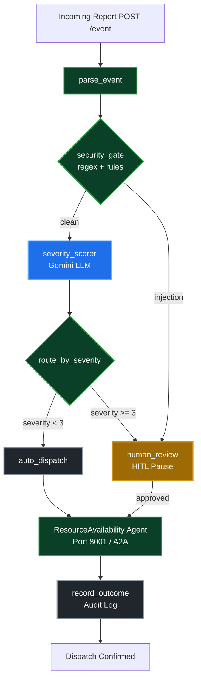

# DispatchAI Architecture

```mermaid
graph TD
    A[Incoming Report POST /event] --> B[parse_event]
    B --> C{security_gate<br>regex + rules}

    C -- "clean" --> D[severity_scorer<br>Gemini LLM]
    C -- "injection" --> E[human_review<br>HITL Pause]

    D --> F{route_by_severity}
    F -- "severity < 3" --> G[auto_dispatch]
    F -- "severity >= 3" --> E

    G --> H[ResourceAvailability Agent<br>Port 8001 / A2A]
    E -- "approved" --> H

    H --> I[record_outcome<br>Audit Log]
    I --> END[Dispatch Confirmed]

    classDef adk fill:#0a4027,stroke:#2ea043,stroke-width:2px,color:white;
    classDef llm fill:#1f6feb,stroke:#58a6ff,stroke-width:2px,color:white;
    classDef hitl fill:#9e6a03,stroke:#d29922,stroke-width:2px,color:white;
    classDef terminal fill:#21262d,stroke:#8b949e,stroke-width:2px,color:white;

    class B,C,F,H adk;
    class D llm;
    class E hitl;
    class G,I terminal;
```
